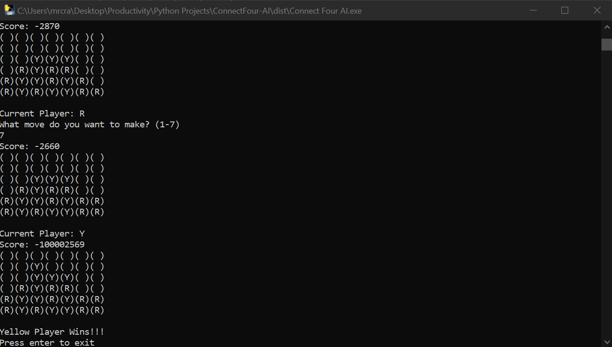

<!-- PROJECT LOGO -->
 

  

<h3 align="center">Connect Four AI</h3>

  

     Originally made in my high school Artificial Intelligence class, this program implements the minimax algorithm that can see any amount of steps ahead.
  

  
Table of Contents

  <ol>
    <li>
      <a href="#project-demo">Project Demo</a>
    </li>
    <li>
      <a href="#built-with">Built With</a>
    </li>
    <li>
      <a href="#installation">Installation</a>
    </li>
    <li>
        <a href="#usage">Usage</a>
    </li>
  </ol>

## Project Demo

(<a href="#readme-top">back to top</a>)

## Built With

* [Python](https://www.python.org/downloads/)

(<a href="#readme-top">back to top</a>)

## Installation

* Download the executable at [here](https://www.mediafire.com/file/pqvcxj40j8z7dpy/Connect_Four_AI.exe/file)

(<a href="#readme-top">back to top</a>)

## Usage

* Enter a number from 1-7 to make a move in the respective column of the board.
* The program will alternate between the player and AI.

(<a href="#readme-top">back to top</a>)

## Implementation

* The numbers 1-7 represent each column of the Connect Four board.
* The scoring system for the [minimax algorithm](https://www.youtube.com/watch?v=KU9Ch59-4vw&ab_channel=GauravSen) is calculated based on different direction of four consecutive board spots. Examples of these consecutive board spots can be find below.

* Each combination of four spots are matched to a dictionary. The keys of the dictionary are tuples where the first value is the count of the current player and the second value is the count of the empty spaces. The values of the dictionary are the different score values.
 
* Each added score from the above dictionary alternates between positive for the player and negative for the AI. This is so that the minimax algorithm can easily maximize for the player by increasing the score towards infinity while minimizing for the AI by decreasing the score towards negative infinity. 

## Contact

Larry Ling - [website](larryling.me) - larryling.main@gmail.com

Project Link: [https://github.com/HecticBanzai/ConnectFour-AI](https://github.com/HecticBanzai/ConnectFour-AI)

(<a href="#readme-top">back to top</a>)

[product-screenshot]: images/demo.png